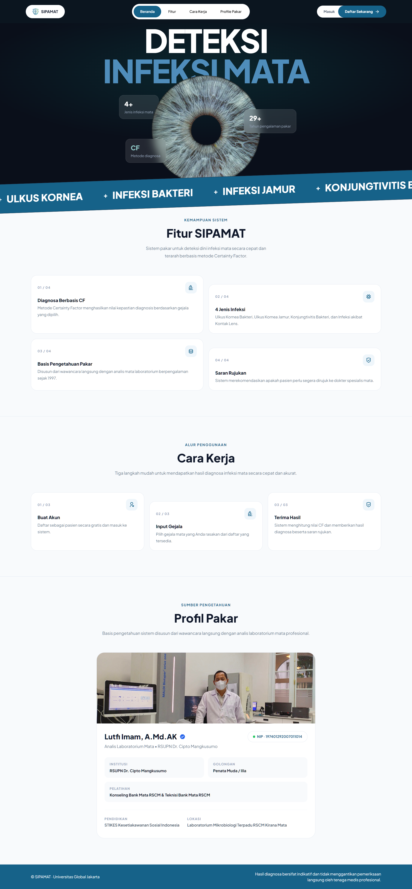
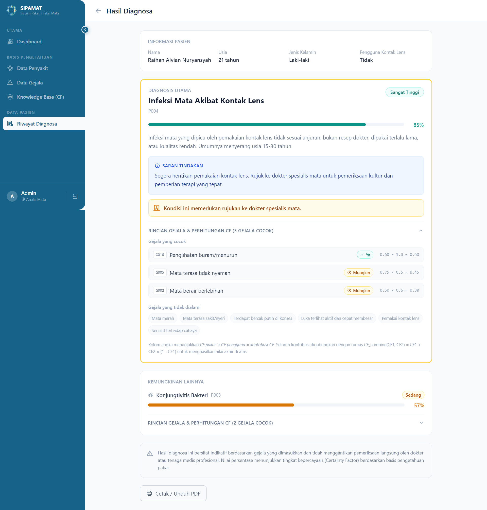

# SIPAMAT — Eye Infection Expert System


A web-based expert system that provides a preliminary diagnosis of eye infections using the **Certainty Factor (CF)** method. Built with **Laravel 11 + React (Inertia.js)**, patients select the symptoms they're experiencing and the system calculates a confidence value for each possible disease based on an expert-defined knowledge base.

> **Note:** The application UI and medical terminology are in Indonesian (Bahasa Indonesia), as this system was built for local clinical use in Indonesia.




---

## 📖 About

SIPAMAT was developed to help with early detection of 4 types of eye infections, based on interviews with an experienced eye laboratory analyst:

| Code | Disease | Referral Needed |
|------|---------|:---:|
| P001 | Bacterial Corneal Ulcer | ✅ |
| P002 | Fungal Corneal Ulcer | ✅ |
| P003 | Bacterial Conjunctivitis | — |
| P004 | Contact Lens–Related Eye Infection | ✅ |

Diagnosis is calculated from **15 symptoms (G001–G015)**, each with an expert CF value (*cf_expert*), combined with the patient's answer (*cf_user*: Yes = 1.0, Maybe = 0.6, No = 0.0) using the standard CF combination formula.

## ✨ Key Features

- 🩺 **Certainty Factor–based diagnosis** — patients answer symptom questions and the system calculates a confidence score per disease.
- 📄 **Diagnosis history** & **PDF export** of results (DomPDF).
- 🔐 **Full authentication** — register, login, email verification, password reset (Laravel Breeze style).
- 🛠️ **Admin panel**:
  - Manage diseases & symptoms (CRUD)
  - Manage the knowledge base (expert CF values per disease-symptom pair)
  - View all patient diagnosis history
  - Statistics dashboard (disease count, symptom count, diagnoses, patients)
- 👤 **Role-based access** — separate `admin` and `patient` middleware.

---

## 🛠️ Tech Stack

- **Backend:** Laravel 11 (PHP)
- **Frontend:** React 18 + Inertia.js
- **Styling:** Tailwind CSS
- **Build tool:** Vite
- **PDF:** barryvdh/laravel-dompdf
- **Database:** MySQL (configurable via `config/database.php`)

---

## 📸 Screenshots

### Diagnosis Result


---

## 🚀 Local Installation

```bash
# 1. Clone the repository
git clone https://github.com/ralvihan/sipamat-eye-infection-expert-system.git
cd sipamat-eye-infection-expert-system

# 2. Install backend dependencies
composer install

# 3. Install frontend dependencies
npm install

# 4. Copy .env and generate app key
cp .env.example .env
php artisan key:generate

# 5. Configure your database in .env, then run migrations + seeder
php artisan migrate --seed

# 6. Start the backend server
php artisan serve

# 7. Start the Vite dev server (in a separate terminal)
npm run dev
```

Visit the app at `http://localhost:8000`.

### Default Accounts (from seeder)

| Role | Email | Password |
|------|-------|----------|
| Admin | admin@sipamat.com | password |
| Patient | raihan@sipamat.com | password |
| Patient | sultan@sipamat.com | password |

---

## 📁 Project Structure (overview)

```
app/
 ├─ Http/Controllers/
 │   ├─ Admin/AdminController.php     # CRUD for diseases, symptoms, knowledge base, diagnoses
 │   └─ DiagnosisController.php       # Patient diagnosis flow + PDF export
 ├─ Services/CertaintyFactorService.php  # Core CF calculation logic
 └─ Models/                           # Disease, Symptom, DiseaseSymptom, Diagnosis, User
resources/js/
 ├─ Pages/Admin/                      # Admin panel pages
 ├─ Pages/Patient/                    # Diagnose, DiagnoseResult, History
 └─ Pages/Welcome.jsx                 # Landing page
```

---

## 👤 Author

- **Raihan Alvian** ([@ralvihan](https://github.com/ralvihan))

---

## 📄 License

This project was built for academic purposes (Informatics Engineering coursework, Jakarta Global University) and is free to use for learning purposes.